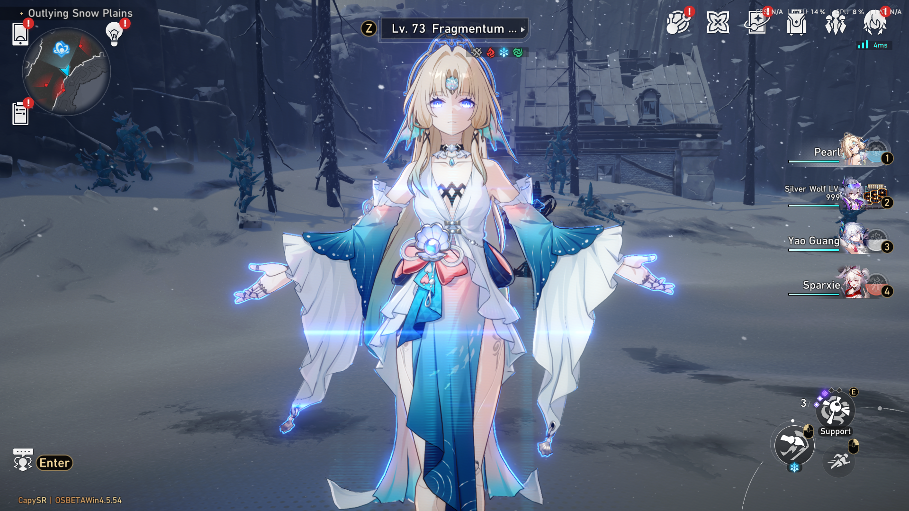

# CapySR - WIP

A server reimplementation written in C++ for a certain anime game with star and rails. Targets the `4.5.5x beta` (usually the latest). This server is in WIP, but you can still use it.



## Requirements

1. Visual Studio 2026 Community (or the smaller Build Tools): https://visualstudio.microsoft.com/downloads/
   In the installer, tick "Desktop development with C++". That brings the compiler, the Windows SDK, CMake and Ninja; keep "C++ CMake tools for Windows" ticked, which it is by default.
2. Python 3: https://www.python.org/downloads/windows/
   Tick "Add python.exe to PATH" during install.
3. protoc: https://github.com/protocolbuffers/protobuf/releases
   Download protoc-<version>-win64.zip, unzip it, and add its bin folder to PATH. Pick the newest normal release, not an -rc one.
4. The Python protobuf package, which is required. tools/gen_proto.py imports google.protobuf, so the build fails without it. Install it with: `py -m pip install protobuf`

## Build

```powershell
.\build.ps1            # to build
```

Then find the outputs at `build\bin\`

## Running it

Supports both `CN` and `OS` client. You can get the latest client here: [CN](https://gofile.io/d/vtV5JfkO) or [OS](https://gofile.io/d/wAT1UiJj). Recommends you use 7z to extract.

1. Copy `launcher.exe` and `hkrpg.dll` from launcher folder inside CapySR and paste them inside your client folder (Thank you Reversed Rooms)
2. Start the server: `build\bin\capysr.exe`.
3. Run the `launcher.exe` **as administrator**.
4. Log in with any account name and password; the SDK routes accept anything.

Delete `data/player.json` to start over from the defaults in `config/config.json` if needed.

## srtools

The server also supports <https://srtools.neonteam.dev/>!

## Credit
- capyb2222
- Various other server for references.

## Troubleshooting
- You can create an issue in this repository, but it is not guaranteed I will be there to help.